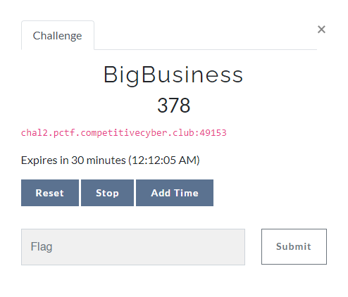

# CTFd Docker Containers Plugin

This CTFd plugin allows you to run ephemeral Docker containers for specific challenges. Teams can request a container to use as needed, and its lifecycle will be managed by the plugin.

## Usage

Place this plugin in your CTFd/plugins directory. The name of the directory MUST be "containers" (so if you cloned this repo, rename "CTFd-Docker-Plugin" to "containers").

To configure the plugin, go to the admin page, click the dropdown in the navbar for plugins, and go to the Containers page. Then you can click the settings button to configure the connection. You will need to specify some values, including the connection string to use. This can either be the local Unix socket, or an SSH connection. If using SSH, make sure the CTFd host can successfully SSH into the Docker target (i.e. set up public key pairs). The other options are described on the page. After saving, the plugin will try to connect to the Docker daemon and the status should show as an error message or as a green symbol.

To create challenges, use the container challenge type and configure the options. It is set up with dynamic scoring, so if you want regular scoring, set the maximum and minimum to the same value and the decay to zero.

If you need to specify advanced options like the volumes, read the [Docker SDK for Python documentation](https://docker-py.readthedocs.io/en/stable/containers.html) for the syntax, since most options are passed directly to the SDK.

When a user clicks on a container challenge, a button labeled "Get Connection Info" appears. Clicking it shows the information below with a random port assignment.

A note, we used hidden teams as non-school teams in PCTF 2022 so if you want them to count for decreasing the dynamic challenge points, you need to remove the `Model.hidden == False,` line from the `calculate_value` function in `__init__.py`.
